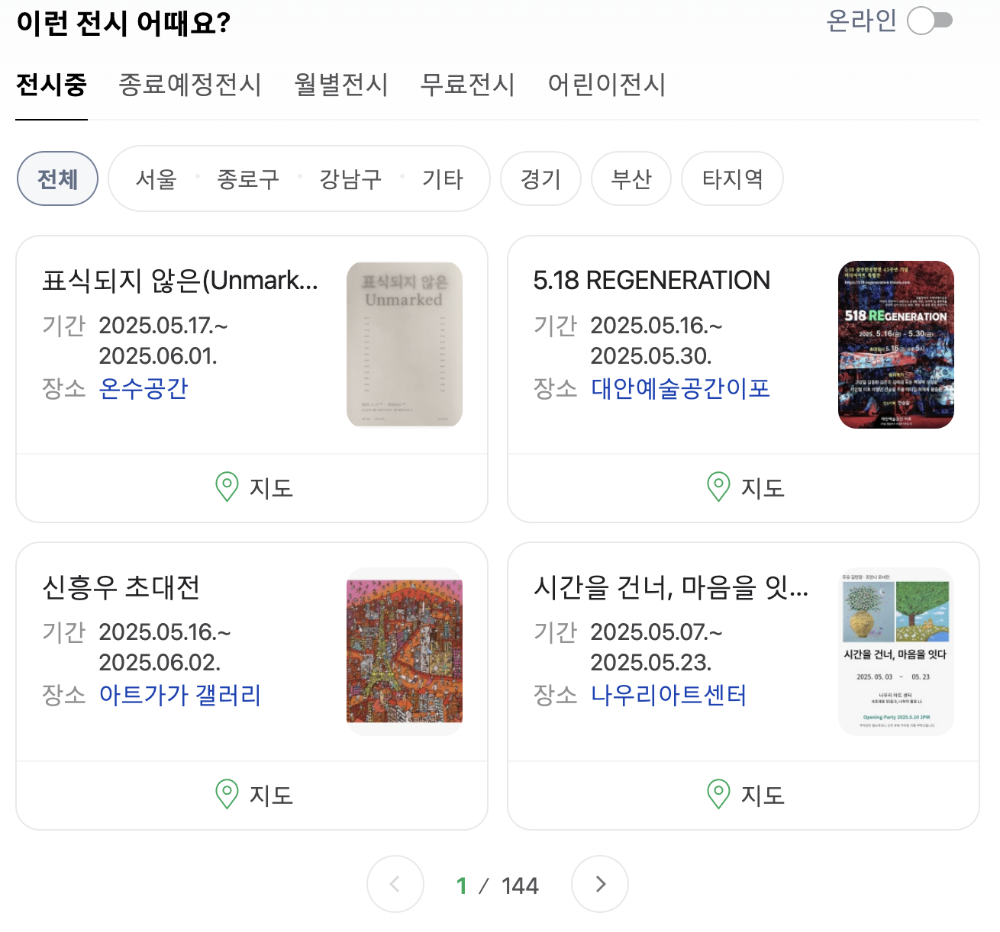
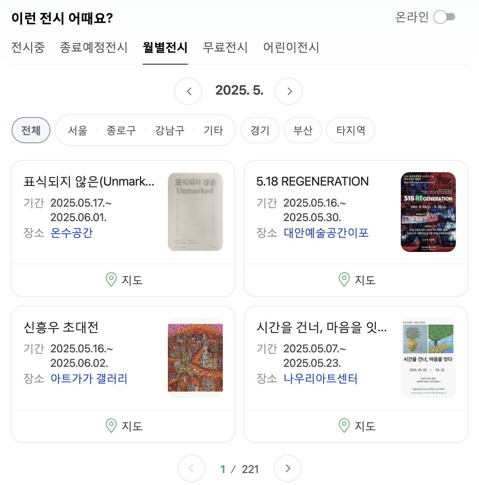
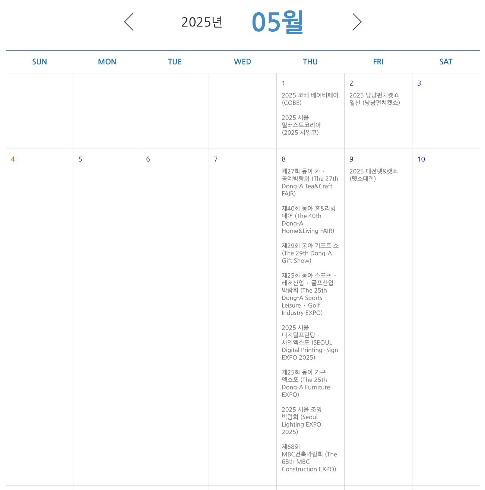
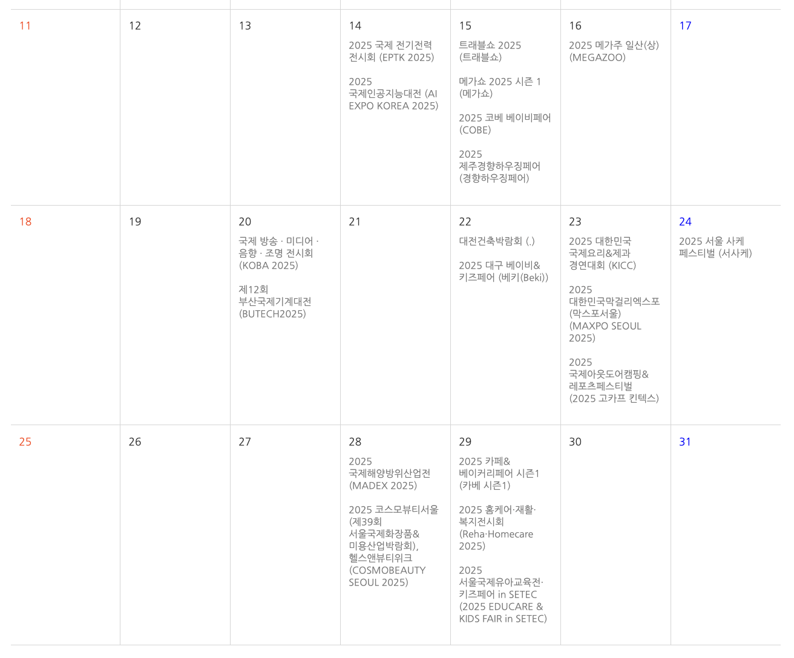
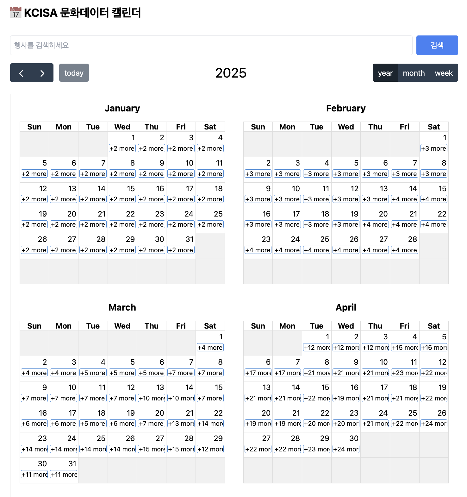
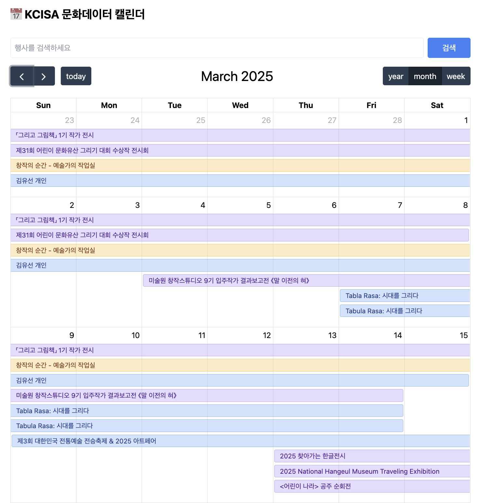
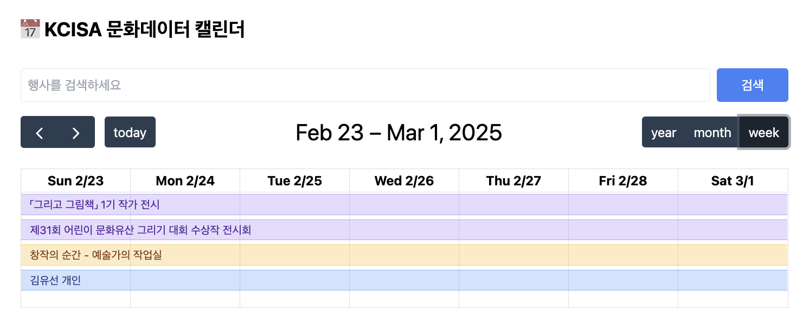
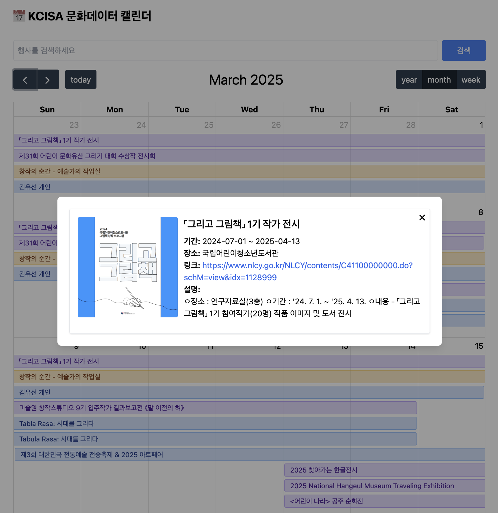
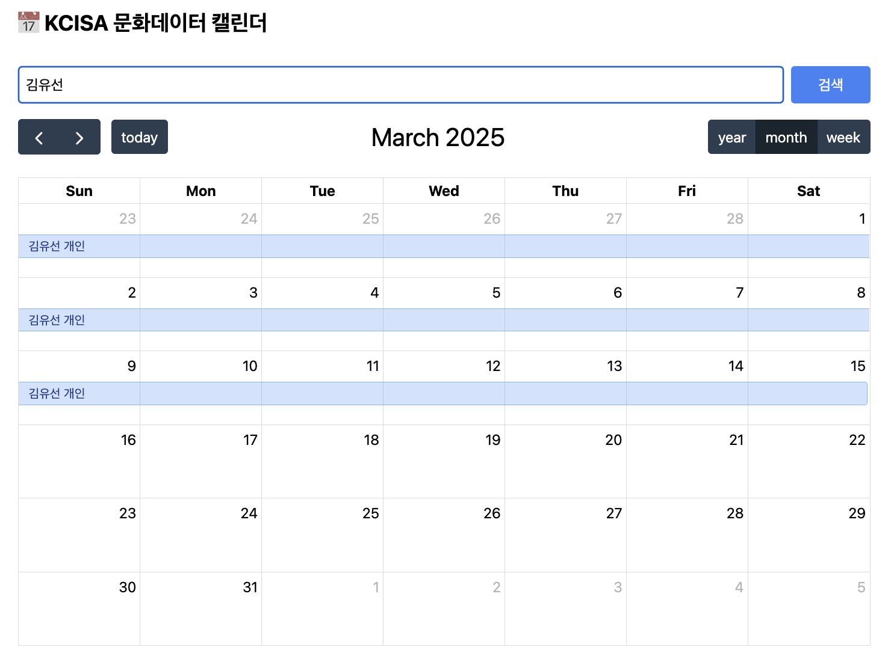

# 주제: 문화행사정보 캘린더

## 프로젝트 배경 및 문제점

- 네이버, KEOA 한국전시주최자협회 등의 **웹 사이트에서 국내 문화 행사 및 전시 등의 정보를 제공**하고 있음.
- 제공하고 있는 정보들은 **민간 단체 행사 및 정부 소속 기관인 문화체육관광부에서 주관하는 전시 및 행사를 포함**하고 있음.
- 민간 단체의 전시 관람 비용은 정부 기관에서 주관하는 전시보다 **높은 가격대가 형성되어 있어 문화 행사 참여에 어려움**이 있음.
- **전시 정보를 한 눈에 확인하는데 어려움**이 있음

<div style="display: flex; flex-direction:column; gap:10px">
  <div style="display: flex; gap: 10px;">
    
    
  </div>

  <div style="display: flex; gap: 10px;">
    
    
  </div>
</div>

## 프로젝트 목표

- 문화관광체육부 소속 기관의 전시 정보 데이터([API](https://www.culture.go.kr/data/openapi/openapiView.do?id=598))를 활용함.
  - 소속 기관: 미술관, 박물관, 문화 정보원 등
- 달력 형태로 정보를 제공하는 웹 어플리케이션 제작.
  - [FullCalendar](https://fullcalendar.io/) 활용

# 기능 명세

- JSON 기반의 API활용해서 정보 가져와 보여 주기(axios)
- 1페이지 기준으로 작성
- 하위컴포넌트를 가져와 보여 주는 방식(props, 필요시 emit)
- 최대한 onMounted, computed, ref, reactive, watch 활용해서 구현
- UI는 tailwind와 style scoped 활용

## 추가 기능 명세

- Modal 창을 이용하여 정보 출력
- 검색 기능 추가

## 2. 내용

### 연도별 캘린더



### 월별 캘린더



### 주별 캘린더



### 전시 일정 클릭 시, 모달 창 팝업



### 검색 기능



# 사용 API 및 라이브러리

[문화체육관광부 소속 기관 전시 정보 데이터](https://www.culture.go.kr/data/openapi/openapiView.do?id=598)

[FullCalendar 라이브러리](https://fullcalendar.io/)

# Getting Start

## yarn

```bash
yarn install
yarn add @fullcalendar/vue3 @fullcalendar/core @fullcalendar/daygrid @fullcalendar/interaction
```

## npm

```bash
yarn install
npm install --save \
  @fullcalendar/core \
  @fullcalendar/vue3
```
